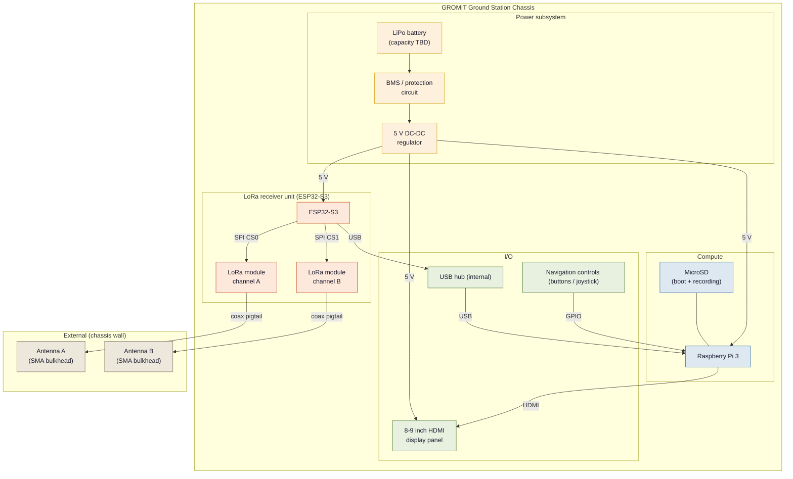

```mermaid
graph TD
 classDef compute fill:#dde8f0,stroke:#2e6b9e,color:#1a1a2e
 classDef power fill:#fdf0dc,stroke:#d4a017,color:#1a1a2e
 classDef receiver fill:#fde8dc,stroke:#c9430e,color:#1a1a2e
 classDef io fill:#e8f0e0,stroke:#4a7c2e,color:#1a1a2e
 classDef antenna fill:#ede8dc,stroke:#7a6e5e,color:#1a1a2e

subgraph chassis["GROMIT Ground Station Chassis"]
  subgraph power["Power subsystem"]
    BAT["LiPo battery\n(capacity TBD)"]:::power
    BMS["BMS / protection\ncircuit"]:::power
    REG["5 V DC-DC\nregulator"]:::power
    BAT --> BMS --> REG
  end

  subgraph compute["Compute"]
    PI["Raspberry Pi 3"]:::compute
    SD["MicroSD\n(boot + recording)"]:::compute
    SD --- PI
  end

  subgraph receiver["LoRa receiver unit (ESP32-S3)"]
    ESP["ESP32-S3"]:::receiver
    LORA1["LoRa module\nchannel A"]:::receiver
    LORA2["LoRa module\nchannel B"]:::receiver
    ESP -- SPI CS0 --> LORA1
    ESP -- SPI CS1 --> LORA2
  end

  subgraph io["I/O"]
    HUB["USB hub (internal)"]:::io
    DISP["8-9 inch HDMI\ndisplay panel"]:::io
    CTRL["Navigation controls (buttons / joystick)"]:::io
  end

  REG -- 5 V --> PI
  REG -- 5 V --> ESP
  REG -- 5 V --> DISP
  ESP -- USB --> HUB
  HUB -- USB --> PI
  CTRL -- GPIO --> PI
  PI -- HDMI --> DISP
end

subgraph external["External (chassis wall)"]
  ANT1["Antenna A\n(SMA bulkhead)"]:::antenna
  ANT2["Antenna B\n(SMA bulkhead)"]:::antenna
end

LORA1 -- coax pigtail --> ANT1
LORA2 -- coax pigtail --> ANT2
```
