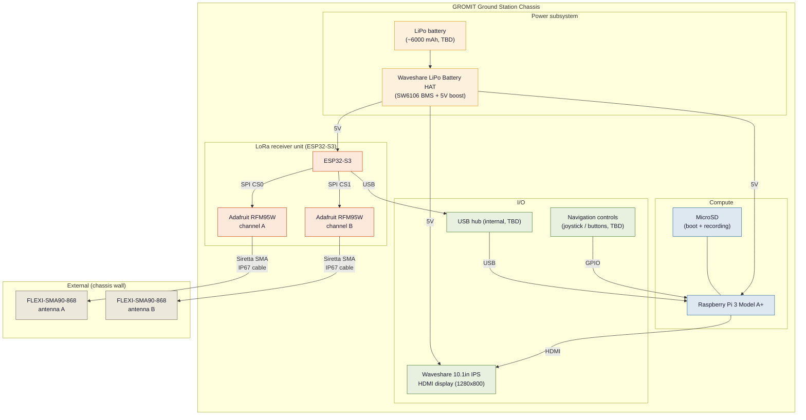

```mermaid
graph TD
    classDef compute fill:#dde8f0,stroke:#2e6b9e,color:#1a1a2e
    classDef power fill:#fdf0dc,stroke:#d4a017,color:#1a1a2e
    classDef receiver fill:#fde8dc,stroke:#c9430e,color:#1a1a2e
    classDef io fill:#e8f0e0,stroke:#4a7c2e,color:#1a1a2e
    classDef antenna fill:#ede8dc,stroke:#7a6e5e,color:#1a1a2e

    subgraph chassis["GROMIT Ground Station Chassis"]
        subgraph power["Power subsystem"]
            BAT["LiPo battery\n(~6000 mAh, TBD)"]:::power
            HAT["Waveshare LiPo Battery HAT\n(SW6106 BMS + 5V boost)"]:::power
            BAT --> HAT
        end

        subgraph compute["Compute"]
            PI["Raspberry Pi 3 Model A+"]:::compute
            SD["MicroSD\n(boot + recording)"]:::compute
            SD --- PI
        end

        subgraph receiver["LoRa receiver unit (ESP32-S3)"]
            ESP["ESP32-S3"]:::receiver
            LORA1["Adafruit RFM95W\nchannel A"]:::receiver
            LORA2["Adafruit RFM95W\nchannel B"]:::receiver
            ESP -- SPI CS0 --> LORA1
            ESP -- SPI CS1 --> LORA2
        end

        subgraph io["I/O"]
            HUB["USB hub (internal, TBD)"]:::io
            DISP["Waveshare 10.1in IPS\nHDMI display (1280x800)"]:::io
            CTRL["Navigation controls\n(joystick / buttons, TBD)"]:::io
        end

        HAT -- 5V --> PI
        HAT -- 5V --> ESP
        HAT -- 5V --> DISP
        ESP -- USB --> HUB
        HUB -- USB --> PI
        CTRL -- GPIO --> PI
        PI -- HDMI --> DISP
    end

    subgraph external["External (chassis wall)"]
        ANT1["FLEXI-SMA90-868\nantenna A"]:::antenna
        ANT2["FLEXI-SMA90-868\nantenna B"]:::antenna
    end

    LORA1 -- "Siretta SMA\nIP67 cable" --> ANT1
    LORA2 -- "Siretta SMA\nIP67 cable" --> ANT2
```
